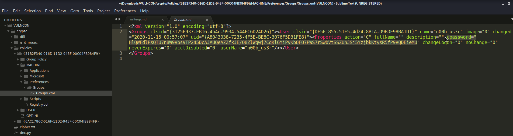

# `Double (100)`
> Is it Double Encoding? <br>
> 6fp5ou50v5uj3x35gu4p456g4p15tv5wk5gu5b35gz4p44vm53x

## Sol
After googling a lot, I found it finally!!!  [Twin-Hex Cypher Encoder/Decoder](https://www.calcresult.com/misc/cyphers/twin-hex.html)

## Flag
> vulncon{Twin_Hex_Encoding_is_Hard}

# `Go On Date? (100)`
> Here is your cipher! <br>
> Flag Format: vulncon{decoded_string_with_underscore} <br>
> `ddve uhkft fkpjet enfqdknis`
> [Chall file](gravity.jpg)

## Sol
* We found a Morse Code from the bottom right part of the given image [decoding](https://gchq.github.io/CyberChef/#recipe=From_Morse_Code('Forward%20slash','Line%20feed')&input=LS0tLS8uLi4tLS8uLi0tLS8tLS0tLS8uLi0tLS8tLS0tLS8uLi0tLS8tLS0tLS8vLy8) which gives us `03202020`
* Yet Another Shift Cipher (Date Shift Cipher). Here is the decoder - [decode.fr](https://www.dcode.fr/shift-cipher)
* **Settings:**
    * Set `Multiple Shifting following the number sequence (.,.,…) in loop:` `0,3,2,0,2,0,2,0`
    * Change/Shift : Each character (/C)

## Flag
> vulncon{date_shift_cipher_encodings}

# `PollMor (100)`
> Morphy wanted to study about "Index of coincidence" so she went to Dcode University near searchbar Playstation. Professor PollMor gave her a critical assignment to complete before VULNCON CTF ends. Help Her to complete the assignment and get the flag :) <br>
> Flag Format: vulncon{words_seperated_by_underscore} <br>
> [Chall file](PollMor_cipher.txt)

## Sol
* It was [Pollux Cipher](https://www.dcode.fr/pollux-cipher#q1) and we can use this [decoder](https://www.dcode.fr/pollux-cipher) with the given settings.
* Result
```
V U L N C O N P 0 L L U X 4 N D M 0 R S E A R 3 B R 0 T H 3 R S
...- ..- .-.. -. -.-. --- -. .--. ----- .-.. .-.. ..- -..- ....- -. -.. -- ----- .-. ... . .- .-. ...-- -... .-. ----- - .... ...-- .-. ...
```
## Flag
> vulncon{p0llux_4nd_m0rse_ar3_br0th3rs}


# `can_you_c_the_password? (100)`
> Decrypt the password and submit it as the flag! <br>
> [Chall file](cpass.zip)

## Sol
This was a unique challenge. They gave us the Windows Group Policy Preferences an we can easily decrypt the **cpassword** with a python script.
* Some basic research tells us the mystry of **cpassword**


Except at some point prior to 2012, [Microsoft published the AES private key on MSDN](https://docs.microsoft.com/en-us/openspecs/windows_protocols/ms-gppref/2c15cbf0-f086-4c74-8b70-1f2fa45dd4be?redirectedfrom=MSDN) which can be used to decrypt the password. Since authenticated users (any domain user or users in a trusted domain) have read access to SYSVOL, anyone in the domain can search the SYSVOL share for XML files containing “cpassword” which is the value that contains the AES encrypted password.

* The Key
```
2.2.1.1.4 Password Encryption

    02/14/2019
    2 minutes to read

All passwords are encrypted using a derived Advanced Encryption Standard (AES) key.<3>

The 32-byte AES key is as follows:

     4e 99 06 e8  fc b6 6c c9  fa f4 93 10  62 0f fe e8
     f4 96 e8 06  cc 05 79 90  20 9b 09 a4  33 b6 6c 1b
```
* Cool!!! We have the key and now we need to make a script but I was lazy and managed to find one online.

### Script: [Gpprefdecrypt.py](https://github.com/leonteale/pentestpackage/blob/master/Gpprefdecrypt.py)

* Requirements: 
	* `python2`
	* `pip2 install pycryptodome`

```py
#!/usr/bin/python
#
# Gpprefdecrypt - Decrypt the password of local users added via Windows 2008 Group Policy Preferences.
#
# This tool decrypts the cpassword attribute value embedded in the Groups.xml file stored in the domain controller's Sysvol share.
#

import sys
from Crypto.Cipher import AES
from base64 import b64decode

if(len(sys.argv) != 2):
  print "Usage: gpprefdecrypt.py <cpassword>"
  sys.exit(0)

# Init the key
# From MSDN: http://msdn.microsoft.com/en-us/library/2c15cbf0-f086-4c74-8b70-1f2fa45dd4be%28v=PROT.13%29#endNote2
key = """
4e 99 06 e8  fc b6 6c c9  fa f4 93 10  62 0f fe e8
f4 96 e8 06  cc 05 79 90  20 9b 09 a4  33 b6 6c 1b
""".replace(" ","").replace("\n","").decode('hex')

# Add padding to the base64 string and decode it
cpassword = sys.argv[1]
cpassword += "=" * ((4 - len(sys.argv[1]) % 4) % 4)
password = b64decode(cpassword)

# Decrypt the password
o = AES.new(key, AES.MODE_CBC, "\x00" * 16).decrypt(password)

# Print it
print o[:-ord(o[-1])].decode('utf16')
``` 


### Output
```console
root@kali:~/Downloads/VULNCON/crypto# python2 dec.py "HlQWFdlPXQTU7n8W9VbsVTP245DcAJAUQeAZZfkJE/Q8ZlWgwj7CqKl6YiPvKbQFO7PWS7rSwbVtSSZUhJSj5YzjbkKtyXR5fP9VQDEieMU"
vulncon{s3cur1ty_h4s_3volv3d_s0__much}

```

## Flag
> vulncon{s3cur1ty_h4s_3volv3d_s0__much}

# `diffeRent_but_SimilAr (436)`
> A Diva challenged me if I can crack an encryption algorithm that she knows in and out! Can you help me crack the algorithm? <br>
> [Chall file](rsa.zip)

## Sol
* Requirements
	* Python
	* SageMath
	* pycryptodome

### The Encryption

```py
#!/usr/bin/env sage

from public_key import e, n
from secret import secret

from binascii import hexlify
from sage.all import GF, PolynomialRing
from Crypto.Util.number import long_to_bytes, bytes_to_long

P=PolynomialRing(GF(2),'x')
n_poly = P(n)
R.<a> = GF(2^2049)

ciphertext = b''

for idx in secret:
    idx_int = bytes_to_long(idx.encode())
    idx_poly = P(R.fetch_int(idx_int))
    c_idx_poly = pow(idx_poly, e, n_poly)
    c_idx_int = R(c_idx_poly).integer_representation()
    ciphertext += long_to_bytes(c_idx_int) + b'\n'*3

open('secret', 'wb').write(ciphertext)
```

The encryption basically does the following things,

* Change each character of the message into element of GF(2^2049).
* Represent this as element of the ring P.
* Raises this polynomial representation of the **character** to the power of **e** mod polynomial **n** (same as **m ^ e mod n** in normal RSA).
* Take the Integer representation of this and convert it into raw bytes
* Append each chunks of raw bytes followed by 3 newline chars '\n' to the ciphertext


### The Decryption
So it was a classic RSA challenge where they used polynomial N in PolynomialRing over GF(2). We can applay the basic approach like we do in normal RSA which will look like this,

* Factor polynomial n into p and q
* Calculate **phi**
* Calculate **d**
* Decrypt each ciphertext character like we do in normal RSA but this time we'll use the polynomial n

### Solve Script - [solve.sage](solve.sage)
```py
#!/usr/bin/env sage

from public_key import e,n
from sage.all import GF, PolynomialRing
from Crypto.Util.number import long_to_bytes, bytes_to_long

enc = open('secret','rb').read().strip().split(b'\n\n\n')

R.<a> = GF(2^2049)
P = PolynomialRing(GF(2),'x')
n = P(n)

p,q = n.factor()
p,q = p[0],q[0]
np = pow(2, p.degree())
nq = pow(2, q.degree())
phi = (np-1) * (nq-1)
d = inverse_mod(e, phi)

pt = b''

for c in enc:
	c_idx_int = bytes_to_long(c)
	c_idx_poly = P(R.fetch_int(c_idx_int))
	idx_poly = pow(c_idx_poly,d,n)
	idx_int = R(idx_poly).integer_representation()
	pt += long_to_bytes(idx_int)

print(pt)

```

### Output
```console
root@kali:~/Downloads/VULNCON/crypto/diff# sage solve.sage
b'Here is your secret password: PPfTx6>:Gc.r[~9P'
root@kali:~/Downloads/VULNCON/crypto/diff# 
```
So we can get the zip password from here and get the flag from the zip.

## Flag
> vulncon{man1@C_L!k35_s@g3}
