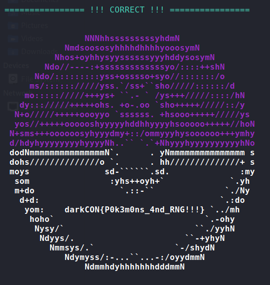

# PokePark - Raising New Generation Writeup (6 solves / 497 points)
> nc 3.16.14.62 5000

### [Solve Script](sol/apex.py)
```py
from Crypto.Util.number import inverse, GCD
from functools import reduce

def get_inc(states, m, n):
	s1 = states[0]
	s2 = states[1]
	return ( s2 - m * s1) % n

def get_mult(states, n):
	s1 = states[0]
	s2 = states[1]
	s3 = states[2]
	m = ((s3 - s2) * inverse(s2-s1, n)) % n
	return m

def get_mod(states):
	diffs = [b - a for a, b in zip(states, states[1:])]
	z = [a*c - b**2 for a, b, c in zip(diffs, diffs[1:], diffs[2:])]
	n = reduce(GCD, z)
	return n

def predict_state(curr_state, n, m, c):
	pred = (m * curr_state + c) % n
	return pred

if __name__ == '__main__':

	states = [1997095401, 13001997, 1628715232, 1990339562, 284249215, 1372925577, 48385624, 1468364002, 2059193937, 26044107]

	n = get_mod(states)
	print("n:", n)

	m = get_mult(states, n)
	print("m:", m)

	c = get_inc(states, m, n)
	print("c:", c)

	print("predicted:", predict_state(states[-1], n, m, c))

```
The name of the challenge was supposed to be a hint that it's Park-Miller Random Number Generator 😅. Here is a little bit of intro stuff about 
this Random Number Generator (RNG).

<p align="center"><b>
State[i+1] = m * State[i] mod n
</b></p>

where **m** is the multiplier and n is the prime modulus. So the next **State[i+1]** is determined by multiplying the
current **State[i]** with **m** and then mod **n**.

## Predicting The Next State
### The Mudulus
According to this - [Cracking a linear congruential generator](https://security.stackexchange.com/questions/4268/cracking-a-linear-congruential-generator)
we can recover the mudulus by this method:

*To recover m, define t<sub>n</sub> = s<sub>n</sub> + 1 - s<sub>n</sub> and u<sub>n</sub> = |t<sub>n</sub> + 2 * t<sub>n</sub> - t2<sub>n</sub> + 1|;
then with high probability you will have m = gcd(u1, u2, ..., u10). 10 here is arbitrary; if you make it k, then the probability that this fails is 
exponentially small in k.*

### The Multiplier
We can get the multiplier by solving the two linear equations only,
<p align="center"><b>
s1 = s0 * m + c  (mod n) <br>
s2 = s1 * m + c  (mod n) <br>
s2 - s1 = s1 * m - s0 * m  (mod n) <br>
s2 - s1 = m * (s1 - s0)  (mod n) <br>
m = ((s2 - s1) * inverse_mod(s1 - s0, n)) (mod n)
</b></p>

where **s0, s1 and s2** are the three consecutive states.

### The Increment
The increment for Lehmer RNG is 0 but if you want you can recover that too,
<p align="center"><b>
s1 = s0 * m + c   (mod n) <br>
c  = s1 - s0 * m  (mod n)
</b></p>

Now that we have the modulus, multiplier and the increment( which is 0 anyway) we can predict the next state like this:

<p align="center"><b>
next_state = m * last_state + c (mod n)
</b></p>

Now submit the predicted value and get the flag !!! \o/

[](solve.mp4)

## Flag
> darkCON{P0k3m0ns_4nd_RNG!!!}


### # Source Code + the binary - [[./src folder]](src/)

## Ref
* [Lehmer random number generator - Wiki](https://en.wikipedia.org/wiki/Lehmer_random_number_generator)
* [Cracking a linear congruential generator](https://security.stackexchange.com/questions/4268/cracking-a-linear-congruential-generator)
